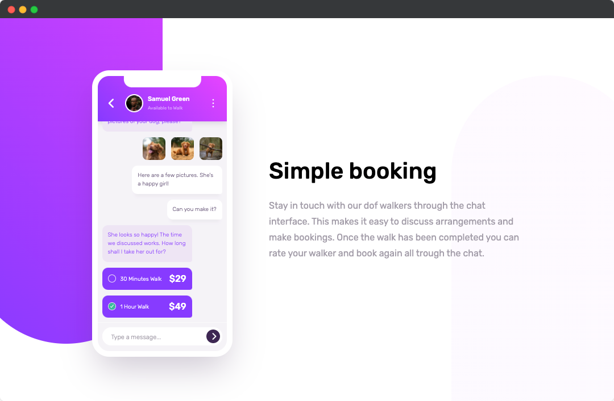

# FrontendMentor Challenge | Chat App CSS Illustration

This is a challenge from FrontendMentor.   
You can find the description of the task here:  
https://www.frontendmentor.io/challenges/chat-app-css-illustration-O5auMkFqY



My goal in this challenge was to:
- use webpack and gulp together
- no copy-pasting troughout this project (only yanking and putting inside the project)

### How to run
```bash
git clone https://github.com/jeromehaas/chat-app-illustration-fm.git
cd chat-app-illustration-fm
nvm use
npm install 
npm start
```